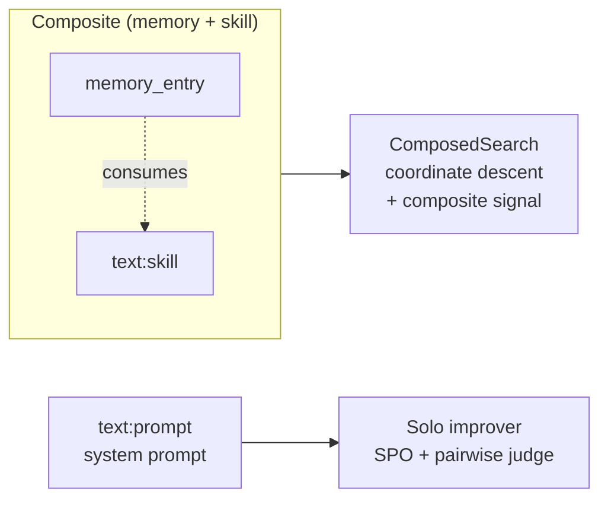

# HelixAgent Architectural Specification

**A framework for self-improving agents**

Companion specification to *Self-Improving Agents* (Lanham, Manning, in MEAP).

---

## Preface

This document specifies the architecture of HelixAgent, the running project that evolves across the book from a static v0 RAG-plus-ReAct loop into a self-aware, self-improving production agent. The spec defines ten primitives, the protocols they expose, and the rules that govern how they compose. It is the source of truth for the companion repository and the architectural backbone of Chapter 1.

The spec is deliberately framework-agnostic at the implementation layer. Every primitive defined here can be implemented on top of LiteLLM, Pydantic AI, the Anthropic SDK, or raw provider APIs. The book's pedagogy is the spec; the repo is one reference implementation.

Three principles shape the design:

1. **Every form of agent improvement is search guided by a signal, running at a different layer.** The framework expresses this directly: artifacts are the thing under search, signals measure the gap, and search methods propose variants. Layer is metadata, not architecture.

2. **The architecture is additive.** Each chapter introduces a new capability as a hook, an artifact kind, or a signal implementation. The agent loop itself is fixed by Chapter 2 and does not change.

3. **Trajectories are first-class.** Every agent run produces a structured, replayable trajectory. Memory learns from trajectories, eval scores trajectories, reflection summarizes trajectories, drift detection compares trajectories. If trajectories were not a first-class object, every downstream chapter would invent its own log format.

---

## 1. The Artifact

An Artifact is any mutable object under search. Prompts, skill files, tool descriptions, memory entries, judge rubrics, planner code, monitor scaffolds, and (at the frontier) agent code itself all are artifacts. Search runs over artifacts; signals measure artifacts; the archive stores artifacts.

### 1.1 Identity and lineage

Every artifact has a stable identity, an immutable version, and a parent pointer. Mutations produce new versions; existing versions are never modified. This single discipline is what makes archive search, behavior diffs, lineage analysis, and rollback all tractable.

```
Artifact:
    id: stable identifier across versions (e.g. "prompt.retrieval_router")
    version: monotonically increasing integer per id
    parent_id: (id, version) of the artifact this was mutated from, or None for genesis
    kind: enum {text, memory_entry, code, composite}  (search economics; see §1.2)
    subtype: role within the kind (text -> {prompt, tool_description, skill, rubric, planner, monitor}); None when the kind has no subtypes
    content: the artifact's payload (string for text, dict for memory_entry, source string for code, list of constituent refs for composite)
    metadata: open dict for signals, scores, provenance, search method that produced it
    created_at: timestamp
    created_by: search method that produced it, or "human" for hand-authored
```

### 1.2 Kinds, subtypes, and layers

The framework recognizes a closed set of artifact kinds. A kind encodes how an artifact is searched: its content type and the search methods that apply usefully. Role is carried by an optional subtype, and improvement risk is carried by a separate layer derived from `(kind, subtype)`.

The kinds are:

- **text**: natural language the LLM reads, mutated by text search (SPO, GEPA, reflective mutation). The subtype names the role and is a closed set: `prompt`, `tool_description`, `skill`, `rubric`, `planner`, `monitor`. A prompt and a tool description differ in where they attach to the agent, not in how they are mutated, which is why they share a kind.
- **memory_entry**: an episodic or semantic memory record. The storage representation (embeddings, timestamps, retrieval count) is fixed; its content and metadata are the mutable artifact.
- **code**: executable agent code: a tool implementation, a guardrail, or at the frontier agent code itself. Different economics from text (sandboxed, test-gated), which is why it is its own kind rather than a text subtype.
- **composite**: an artifact whose content is a set of constituent refs plus a binding descriptor. Unlike text, its subtype set is open: a composite subtype names a blessed composition shape (`metacognition` is the first, §11.5), and new subtypes are added as new coupled patterns appear. It is the unit of joint search and joint deployment for coupled artifacts; see §18.

The **layer** is a separate property that classifies promotion risk, and it is what the online-safety rule reads (§17.3): online improvers refuse any target at layer 3 or higher. Layer is a function of `(kind, subtype)`, not of kind alone:

| Layer | Members |
| --- | --- |
| L1 | text:prompt, text:tool_description, text:skill, text:rubric, text:planner, text:monitor |
| L2 | memory_entry |
| L3 | composite:metacognition (and other composite subtypes that declare an L3 floor) |
| L4 | code |
| derived | composite, whose layer is `max(subtype floor, max over constituents)` (§18) |

A standalone planner or monitor is L1 text: mutating its wording is a low-risk change, mutated and promoted like any prompt. The L3 risk attaches to the `metacognition` composite that binds a planner, a monitor, and the memory/state the agent reasons over, because the danger of self-modifying reasoning is emergent from the combination, not present in any single part. This is the point of the v0.2 consolidation: search economics live on the kind, deploy risk lives on the layer, and a composite can carry a risk floor higher than any of its constituents.

Archives written under v0.1 carry a retired top-level kind (`prompt`, `skill`, `tool_description`, `rubric`, `planner`, `monitor`) in the `kind` column. The repository migrates them on read by mapping each to `(text, subtype)`; `memory_entry` and `code` are unchanged. New kinds and new subtypes can be added without changing the framework, and each registers a default content type and a default search-compatibility set.

### 1.3 The content-addressed discipline

Artifact content is hashed at creation. The hash is part of the artifact's storage key. Two artifacts with identical content collapse to the same row; mutations that happen to produce identical content are detected and the search method is notified. This is what makes archive deduplication free.

### 1.4 The mutation rule

Mutations are always produced by a search method and always carry a parent pointer. Hand edits by humans are first-class but explicit: a `Human` search method exists for hand-authored variants, and the framework treats human edits with the same lineage discipline as algorithmic ones. This is the architectural expression of the book's stance that hand-tuning Friday afternoons is not different in kind from SPO; it is the worst-performing search method in the family.

### 1.5 What artifacts are not

Artifacts are not the agent's state. State is what flows through the agent loop at runtime; artifacts are the durable, versioned configuration the loop reads. Artifacts are also not data: a retrieved document is not an artifact, but the retrieval prompt that decided what to retrieve is.

---

## 2. The Trajectory

A Trajectory is the structured record of one agent run. It is the unit memory learns from, eval scores, reflection summarizes, and behavior diffs compare.

### 2.1 What a trajectory captures

```
Trajectory:
    id: unique run identifier
    task: the input that started the run (user message, scheduled trigger, etc.)
    steps: ordered list of Steps
    artifacts_used: map from step index to list of (artifact_id, version) tuples
    final_output: the terminal output, if the run completed
    outcome: enum {completed, failed, cancelled, timed_out, awaiting_human}
    started_at, ended_at
    metadata: cost, token count, latency, environment

Step:
    index: position in the trajectory
    kind: enum {model_call, tool_call, tool_result, hook_fire, human_input, artifact_load}
    payload: structured content of the step
    timestamp
```

### 2.2 Replayability

Trajectories are replayable. Given a trajectory and the artifact versions it referenced, the framework can reconstruct the exact input context for any step. This is what makes time-travel debugging possible, what makes counterfactual eval ("what would v2 have done at step 5?") cheap, and what makes MemRL's offline learning feasible without re-running real tool calls.

### 2.3 Trajectories versus messages

A messages array is a flattened, model-facing projection of a trajectory. The framework can produce a messages array from a trajectory; it cannot produce a trajectory from a messages array, because trajectories carry artifact lineage and hook firings that don't appear in messages. The book teaches messages as the wire format and trajectories as the source of truth.

### 2.4 Trajectory scoring

Trajectories can carry scores. A score attached to a trajectory is the outcome side of a `(trajectory, signal, GapMeasurement)` triple. This is the data shape MemRL learns from, the data shape tournament eval aggregates, and the data shape drift detection trends over time.

---

## 3. The Signal (Gap Function)

A Signal is anything that returns a GapMeasurement. The Gap Function frame from Chapter 1 lives here: every form of measurement, from ground-truth eval to LLM-as-Judge to PRM step scoring to formal proof, is a Signal that produces a GapMeasurement.

### 3.1 The GapMeasurement type

```
GapMeasurement:
    score: float in [0, 1], or None for purely pairwise or textual signals
    preference: enum {LEFT, RIGHT, TIE, None} for pairwise signals
    feedback: textual critique, optional, used by reflective search methods
    confidence: float in [0, 1], the signal's self-reported confidence
    rubric_id: (id, version) of the rubric that produced this, if applicable
    signal_id: stable identifier for the signal configuration that produced this
    signal_version: integer version bumped when the signal's semantics change
    triggered: bool, True when the signal's threshold test fired
    raw_value: float or None, the un-normalized observed value (tokens, latency, etc.)
    cost: Cost spent producing this measurement
    metadata: signal-specific extra fields (PRM step scores, judge raw response, etc.)
```

The GapMeasurement is deliberately a union shape rather than a polymorphic hierarchy. Different signal families fill different fields. A pairwise signal fills `preference` and may fill `feedback`. An absolute signal fills `score`. A PRM fills `score` and a per-step array in `metadata`. ContrastiveJudge fills `feedback` with differential critique. A metric signal fills `raw_value` with the observation and `score` with its normalized form. This keeps the consumption side (search methods) uniform.

`signal_id` and `signal_version` are populated by the signal on return; the archive persists them so prior measurements remain attributable. `triggered` is True when the signal's own gap-vs-threshold test fired (§3.6); search methods and improvers can read it independent of the score. `raw_value` carries the pre-normalization observation so dashboards can render both the observed quantity and its normalized form.

### 3.2 The Signal protocol

```
class Signal:
    async def measure(
        self,
        candidate: Artifact,
        trajectory: Trajectory | None = None,
        reference: Artifact | None = None,
        ground_truth: Any | None = None,
    ) -> GapMeasurement: ...

    @property
    def kind(self) -> SignalKind: ...

    @property
    def cost_estimate(self) -> Cost: ...

    @property
    def signal_id(self) -> str: ...

    @property
    def signal_version(self) -> int: ...
```

`signal_id` is a stable identifier for this signal's *configuration*. Two signals of the same kind with different weights, different child sets, or different threshold settings have different ids. Reference implementations derive their id from class name plus a content hash of key config; composite signals derive theirs from a hash of `(kind, weights, child_ids)`.

`signal_version` is bumped by the implementer when the signal's measurement semantics change (rubric edit, weight retune, threshold change). Measurements in the archive remain comparable within the same `(signal_id, signal_version)` pair.

The protocol accepts a candidate artifact and three optional pieces of context. Different signal kinds use different subsets:

- Ground-truth signals use `candidate` and `ground_truth`.
- Absolute LLM judges use `candidate` and `trajectory`.
- Pairwise LLM judges use `candidate`, `reference`, and `trajectory`.
- Environment-reward signals use `trajectory` only.
- Process Reward Models use `trajectory` only and fill the per-step metadata.
- Reflection signals use `trajectory` only and fill `feedback`.
- ContrastiveJudge uses `candidate`, `reference`, and `trajectory`, and fills `feedback` with differential critique distinct from generic pairwise feedback.

### 3.3 The signal families

The book teaches seven families. Each family is an implementation of the Signal protocol and they are interchangeable from the search method's perspective.

**Ground-truth.** A labeled answer key, a code execution outcome, a tool grounding check, a web evidence verification. Precise when available, rare or sparse otherwise. Fills `score`.

**LLM-as-Judge absolute.** A model scores a candidate against a rubric. Fills `score`. Subject to position-of-rubric drift over time, which is why Chapter 8 treats the rubric as an artifact that itself decays.

**LLM-as-Judge pairwise.** A model picks between two candidates. Fills `preference` and optionally `feedback`. The engine behind SPO and Bradley-Terry tournaments. Position bias is mitigated by the swap-and-require-agreement protocol, which the framework provides as a wrapper.

**ContrastiveJudge (the author's contribution).** A pairwise judge that additionally produces a *differential* feedback string: not "B is better because X" but "B is better than A specifically along axis X, where A fails because Y." The differential structure is what makes the feedback usable as direct mutation guidance, which is what lets ContrastiveJudge pair with reflective search methods without losing signal.

**Process Reward Models.** Step-level scoring of a trajectory. Fills `score` (aggregate) and per-step scores in `metadata`. Math-Shepherd, AgentPRM, SWE-PRM are the canonical exemplars.

**Reflection.** A model critiques a trajectory and produces textual feedback for mutation. Fills `feedback`. Used by Reflexion and by reflective branches of GEPA. The framework treats reflection as a signal, not a search method, which is the architectural expression of Chapter 5's "reflection that changes behavior, not just output" test.

**Formal proof (Schmidhuber limit case).** A theorem prover verifies a property. Fills `score` as 1.0 or 0.0. Treated in the book as a frontier signal that bounds the family from above.

**Metric.** A deterministic observation over a Trajectory: total tokens, wall-clock latency, tool-call count, model-call count. Fills `raw_value` with the observation and `score` with its normalized form (§3.6). Combined with a `SignalThreshold` to express "tokens above baseline by more than X" as a triggered measurement. Composes naturally with judge signals in a CompositeSignal so a candidate can be measured for quality and cost simultaneously.

### 3.4 The verifiability ceiling

Every signal has a verifiability ceiling. Ground-truth and formal proof have the highest ceilings on the tasks where they apply. LLM judges have lower, drift-prone ceilings. Reflection has the lowest. The framework does not pick for you; it makes the choice explicit by requiring each Signal to declare its `kind`, which the eval subsystem uses to compose signal stacks (cheap judges as a pre-filter, expensive ground truth on the suspect cases).

### 3.5 Signals compose

A `CompositeSignal` combines multiple signals into a single GapMeasurement via a configurable aggregator (mean, weighted mean, conservative-min, judge-of-judges). This is what makes Chapter 8's multi-judge ensembles and Chapter 9's confidence routing implementable without changing search methods.

Child signals must return scores already normalized to `[0, 1]`. The composite's aggregation operates on normalized scores; mixing a raw-token-count signal with a raw judge score without normalization would let one signal dominate the other by raw magnitude. The `SignalThreshold` mechanism in §3.6 provides the normalization step that signals with non-`[0, 1]` natural ranges (metric signals especially) use to satisfy this contract.

The composite aggregates `triggered` flags independently of scores. The rule depends on the aggregator: `conservative_min` triggers if *any* child triggered; weighted aggregators trigger if a weighted majority triggered. The composite's `metadata["component_triggers"]` carries the per-child trigger list so a downstream consumer can see which child fired even when the aggregate did not. This is what lets a multi-objective improver react to "latency triggered even though overall score is fine" without reading the underlying components by hand.

A CompositeSignal's own `signal_id` (§3.2) derives from a hash of `(kind, weights, child_ids)`, so two composites with the same children in the same weighting share an id, and two composites with different weights or different children are distinct signals with distinct ids — and their measurements remain separately attributable in the archive (§5.2.1).

### 3.6 Thresholds and normalization

Signals that observe an unbounded quantity (token count, latency, error rate) need a normalization step before they can compose with `[0, 1]` judge signals. The framework provides a small dataclass that signals embed when appropriate:

```
@dataclass
class SignalThreshold:
    baseline: float | Callable[[], float] | None
    threshold: float | None
    direction: Literal["minimize", "maximize"]
    normalizer: Literal["minmax", "zscore", "ratio", "identity"]

    def normalize(self, raw: float) -> float        # raw → [0, 1] under direction
    def is_triggered(self, raw: float) -> bool      # |raw - baseline| crosses threshold
```

`baseline` is a fixed number or a callable resolved at measure time (a rolling p50 of recent trajectories, for example). `threshold` is the magnitude of gap that fires `triggered = True`. `direction` flips the normalization sign: latency above baseline is bad (lower normalized score), judge score above baseline is good (higher normalized score). `normalizer` picks the squashing function.

The threshold lives on the signal, not the improver. This is what makes the `triggered` flag portable across improvers, dashboards, and hook handlers: any consumer of a GapMeasurement can read `triggered` without needing to know which improver produced it.

Signals with no meaningful threshold (pairwise judges, reflection) omit the dataclass entirely. `triggered` defaults to False.

---

## 4. The Search

A Search proposes variants of an artifact and selects among them, guided by a signal. The Search protocol absorbs hill-climbing, pairwise mutation (SPO), genetic-Pareto (GEPA), Bayesian (MIPROv2), MCTS (AFlow), archive evolution (DGM, AlphaEvolve, ShinkaEvolve), Q-learning over memory (MemRL), and group-relative selection (GRPO-style). All are instances of propose-measure-select; Section 4.2.1 explains why the evolutionary / reinforcement-learning distinction dissolves at this level.

### 4.1 The Search protocol

```
class Search:
    async def propose(
        self,
        seed: Artifact,
        signal: Signal,
        archive: Archive,
        budget: SearchBudget,
    ) -> AsyncIterator[Variant]: ...

    async def select(
        self,
        candidates: list[Variant],
        signal: Signal,
        archive: Archive,
    ) -> Artifact: ...

    @property
    def kind(self) -> SearchKind: ...

    @property
    def cost_model(self) -> SearchCostModel: ...
```

`propose` is an async iterator because search methods produce candidates over time (a hill-climb produces one at a time; GEPA produces a generation; DGM produces continuously). `select` resolves to the winning artifact, which the search method records back into the archive with its measurement.

### 4.2 The search families

**Hill-climbing.** One candidate per round, accept if better, otherwise reject. Karpathy autoresearch is the canonical exemplar. Cheap, monotonic, captured by local optima. The book's first running example.

**Pairwise mutation (SPO).** Generate a variant, judge it against the current best, accept on win. Pairwise self-supervision is what escapes APE's labeled-data wall. Uses any pairwise signal.

**Genetic-Pareto reflective mutation (GEPA).** Population-based with Pareto-front selection across multiple objectives, reflective mutation guided by textual feedback. ICLR 2026 Oral. Uses pairwise or absolute signals plus reflection.

**Bayesian instruction proposal (MIPROv2).** Bayesian optimization over a search space of instruction templates and few-shot demonstrations. Uses ground-truth signals primarily. DSPy is the canonical implementation.

**MCTS over workflow code (AFlow).** Monte Carlo tree search over workflow modifications. Uses benchmark scoring. ICLR 2025.

**Evolutionary archive search.** A population of candidates kept in an archive with quality-diversity selection. DGM, AlphaEvolve, and ShinkaEvolve are the exemplars at different scales. The archive is a separate primitive (Section 5).

**Memory-grounded Q-learning (MemRL).** A search whose artifact is a memory entry and whose signal is utility. The rare layer-bound search method; the archive is the agent's episodic memory itself.

**Group-relative selection (GRPO-style).** Sample a group of N candidate trajectories, score each, compute each candidate's advantage relative to the group mean, and select the above-average candidates. This is the selection mechanic of Group Relative Policy Optimization (the DeepSeek-R1 method), applied external to the model: the "policy update" is artifact promotion, not a weight update. The framework reuses GRPO's group-relative advantage as a Search, not as a fine-tuning step, which keeps it inside the strict-external-to-the-model thesis (Section 12). Uses an absolute signal scored per candidate in the group.

**Editable meta-procedure (HyperAgents).** The search method itself is an artifact under search. The framework supports this as a degenerate case where the proposing entity is also a Search artifact, with appropriate guards.

### 4.2.1 Evolutionary search and RL-style search are one pattern

The search families above are conventionally split into camps: evolutionary methods (GEPA, DGM, AlphaEvolve) on one side, reinforcement-learning methods (MemRL, GRPO) on the other. The framework rejects that split. Every method here is the same three-step shape: propose variants, measure them with a Signal, select the winners. What varies is two knobs.

The first knob is **how many candidates per round**. Hill-climbing and SPO propose one. GEPA proposes a population. GRPO proposes a group. DGM proposes one per round but samples its seed from an unbounded archive. The framework expresses this difference as the *round shape*: pairwise rounds (one reference, one candidate, a pairwise judge), group rounds (N candidates, an absolute signal, group-relative advantage), and archive-evolutionary rounds (sample-from-history, mutate, record). All three are variations of propose-measure-select, not different primitives.

The second knob is **the selection rule**. SPO accepts on pairwise win. GEPA keeps the Pareto front. GRPO keeps the above-group-mean candidates. DGM keeps everything and re-samples by quality-diversity. These are selection policies over the same measured candidates, not different algorithms in different paradigms.

This is why the book teaches RL-style methods and evolutionary methods in the same chapters with the same primitives. The distinction the literature draws between "evolution" and "reinforcement" is, at the level of this framework, a difference of selection rule and candidate count. The weight-update step that usually accompanies RL is the one thing the framework does not adopt: GRPO's group-relative advantage is a selection signal over artifacts, and the reinforcement it drives is promotion of a better artifact, not a gradient step on model weights.

### 4.3 Searches do not know about layers

A Search proposes-and-selects against any artifact kind it is compatible with. SPO works on prompts, on memory entries, on skill files, on rubrics. GEPA works on the same set. DGM works on all of them and on code. The book teaches this once in Chapter 1 and reaps the payoff across every layer chapter.

The compatibility matrix (which Search applies to which Artifact kind) is data, not code. It is the search-by-signal grid figure rendered as a registry. This is what makes the grid an executable artifact in the repo rather than a static diagram in the book.

Composite artifacts (§18) extend the matrix with a second key. A Search registers against the `composite` kind generically, or against a composite shape: the sorted multiset of constituent `(kind, subtype)` pairs, for example `{memory_entry, text:skill}`. Resolution prefers the most specific match, so a bespoke search for one composition shape overrides the generic composed search for that shape. This keeps the matrix data even as composition makes the artifact space richer.

### 4.4 The search budget

Every search runs against a SearchBudget that caps tokens, dollars, wall-clock time, and number of candidates. Budgets are first-class because Chapter 8's cost-envelope discussion and Chapter 11's production realities depend on the framework treating cost as a constraint, not an afterthought.

---

## 5. The Archive

An Archive is a Pareto-aware store of historical variants with their measurements, lineage, and quality-diversity metadata.

### 5.1 Why a separate primitive

Hill-climbing barely uses an archive (single best). Pairwise methods use it as recent history. GEPA, DGM, AlphaEvolve, and ShinkaEvolve are entirely built on it. Treating the archive as a separate primitive rather than baking it into one search is what lets Chapter 7's frontier survey work with the same archive object the prompt chapters used at smaller scale.

### 5.2 The Archive protocol

```
class Archive:
    async def record(self, variant: Variant, measurement: GapMeasurement) -> None: ...
    async def best(self, k: int = 1, by: str = "score", signal_id: str | None = None) -> list[Variant]: ...
    async def pareto_front(self, objectives: list[str]) -> list[Variant]: ...
    async def sample(self, strategy: SamplingStrategy) -> Variant: ...
    async def lineage(self, artifact: Artifact) -> list[Artifact]: ...
    async def descendants(self, artifact: Artifact) -> list[Artifact]: ...
    async def diversity_metrics(self) -> DiversityMetrics: ...
    async def measurements_for_signal(
        self, signal_id: str, signal_version: int | None = None
    ) -> list[tuple[Variant, GapMeasurement]]: ...
```

The `record` method persists `signal_id`, `signal_version`, `raw_value`, and `triggered` from the GapMeasurement onto the measurement row. The schema's measurement table carries these as nullable columns so existing archives migrate forward without rewrites. New writes populate them; old rows remain valid with nulls.

`best` accepts an optional `signal_id` filter so callers can ask "best under signal X" rather than "best across all measurements." The live champion (§5.5) remains signal-agnostic: it is about which version is deployed, not which signal scored it.

`measurements_for_signal` is the read path for tooling that needs to recompare candidates under a specific signal configuration: the dashboard's "rescore under signal X" view, the eval subsystem's calibration-drift trend, and any future re-measurement pass that runs when a new signal is added.

### 5.2.1 Signal attribution

A measurement without `signal_id` is a measurement whose origin is forgotten. Two consequences follow:

- When the user introduces a new Signal, prior measurements remain in the archive but are not directly comparable to new measurements taken under the new signal. The framework does not auto-rescore; it provides the read path (`measurements_for_signal`) so the user's tooling can decide what to do.
- Two CompositeSignal instances with different weights are *different signals* with different ids. Measurements taken under each remain attributable.

The archive persists `(signal_id, signal_version)` on every row so this attribution is permanent.

### 5.3 Quality-diversity selection

Archives support quality-diversity sampling: pick a variant that is good *and* dissimilar from recent picks. Behavioral characterization (the function that defines "dissimilar") is itself pluggable, because what counts as behaviorally diverse for prompts is different from what counts for skill libraries. This is the architectural hook for ShinkaEvolve's sample efficiency and DGM's open-endedness.

### 5.4 Archives are persistent

An archive survives process restarts. The reference implementation backs onto SQLite for local development and Postgres for production. This matches Chapter 11's drift-detection and rollout discussion, which assumes archives carry history across deployments.

### 5.5 The live champion

Improvement produces many measured candidates; deployment picks one. The archive records this pick explicitly as a promotion:

```
class Archive:
    async def promote(
        self,
        artifact_id: str,
        version: int,
        approver: str,
        reason: str,
    ) -> PromotionRecord: ...

    async def live_champion(self, artifact_id: str) -> Artifact | None: ...

    async def promotion_history(self, artifact_id: str) -> list[PromotionRecord]: ...
```

`live_champion` returns the currently-live version of an artifact id. This is what the running agent reads on each request, and what `build_agent_with_artifacts` (§15.2) resolves missing artifacts against. A promotion is an immutable row in the archive's promotion log; rollbacks appear as ordinary promotions of an earlier version.

`approver` is either a user id (for human gates) or `improver:<id>` when an online improver auto-promotes. The audit trail makes the "who deployed this" question always answerable.

The live champion is distinct from `best()`: `best` orders by score under a signal, `live_champion` reflects an explicit deployment decision. Offline improvers write candidates to the archive but do not promote; promotion happens when a human (or, in online mode, the auto-promotion handler) calls `archive.promote()`. This separation is what makes the offline / online split (§15) coherent.

---

## 6. The Agent Loop and the Hook System

The agent loop is fixed by Chapter 2 and does not change for the rest of the book. Every later capability is added as a hook firing on the loop, an artifact under search, or a signal being measured.

### 6.1 The canonical loop

```
agent.run(task):
    fire(SESSION_START)
    trajectory = new Trajectory(task)
    messages = build_initial_messages(task, system_prompt)

    while iteration < max_iterations:
        fire(PRE_MODEL, messages, trajectory)
        response = model.call(messages, tools)
        fire(POST_MODEL, response, trajectory)
        trajectory.append(model_call=response)

        if not response.tool_calls:
            fire(PRE_OUTPUT, response, trajectory)
            output = validate_output(response)
            fire(SESSION_END, trajectory)
            return output

        for tool_call in response.tool_calls:
            fire(PRE_TOOL, tool_call, trajectory)
            result = execute_tool(tool_call)
            fire(POST_TOOL, tool_call, result, trajectory)
            trajectory.append(tool_call=tool_call, result=result)

        fire(END_OF_TURN, trajectory)

    fire(SESSION_END, trajectory, outcome=TIMED_OUT)
```

### 6.2 The hook points

The framework defines a fixed set of hook points. Hooks are registered against a point and fire in registration order. Hooks can read trajectory, mutate messages (only at PRE_MODEL), short-circuit (refuse at PRE_MODEL or PRE_OUTPUT, cancel a tool call at PRE_TOOL), mutate the request or response payload (at PRE_MODEL or PRE_OUTPUT), or emit side effects (logging, eval, drift detection).

| Hook point | Fires | Mutation rights |
| --- | --- | --- |
| SESSION_START | Once at run start | None |
| PRE_MODEL | Before each model call | May edit messages; may refuse with a Refusal verdict; may patch the request payload |
| POST_MODEL | After each model call | None |
| PRE_TOOL | Before each tool call | May cancel |
| POST_TOOL | After each tool call | None |
| END_OF_TURN | After tool results return to model | None |
| PRE_OUTPUT | Before final output returns | May edit output; may refuse with a Refusal verdict; may patch the response payload |
| SESSION_END | Once at run end | None |
| POST_ARTIFACT_MUTATION | When the archive records a variant | None |

A refusal at PRE_MODEL or PRE_OUTPUT terminates the run immediately with a Refusal result that names the hook (or, for typed wrappers, the artifact id of the guardrail that refused) and a reason string. The framework does not loop back, retry, or rewrite. Refusal is a hard stop. This is what makes the typed Guardrail wrapper (§16.2.1) structurally safe: a misbehaving guardrail cannot be silently bypassed.

### 6.3 What hooks become

Memory injection is a PRE_MODEL hook. Reflection is a SESSION_END hook. Behavior-diff drift detection is a POST_ARTIFACT_MUTATION hook. HITL approval gates are PRE_TOOL hooks that may cancel and surface a proposal. Trajectory recording is implicit (the loop writes; hooks read). The metacognitive scaffold of Chapter 5 is three coordinated hooks: PRE_MODEL (Monitor reads), POST_MODEL (Reflector reads), END_OF_TURN (TSM decides).

This is the architectural payoff for the book's claim that the agent loop does not change. By the end of Chapter 11, HelixAgent has roughly twenty registered hooks. The agent loop is the same eight-line skeleton it was in Chapter 2.

---

## 7. The Memory Subsystem

Memory is four tiers behind a uniform contract, with each tier exposing the same operations and differing in storage, indexing, and consolidation policy.

### 7.1 The memory contract

```
class MemoryTier:
    async def read(self, query: Query, context: Context) -> list[Entry]: ...
    async def write(self, entry: Entry) -> EntryId: ...
    async def score(self, entry: Entry) -> float: ...
    async def evict(self, policy: EvictionPolicy) -> int: ...
    async def consolidate(self) -> ConsolidationReport: ...
```

### 7.2 The four tiers

**Working memory.** What is currently in the model's context window. Storage is the messages array. Read returns relevant slices; write appends; evict is context-window management; consolidate is the summarization pass that compresses old turns. Cheapest tier, smallest, highest impact on every turn.

**Episodic memory.** Events and trajectories indexed for retrieval. Storage is a vector database plus structured metadata. The artifact under search at this tier is the episodic entry: its schema, its embedding choice, its summarization. MemRL operates here.

**Semantic memory.** Facts learned about the world: user preferences, organization policies, domain constants. Storage is a key-value store with optional vector index. The artifact under search is the semantic entry's content and its scoring function.

**Procedural memory.** Skills with provenance and reuse. Storage is the skill registry. The artifact under search is the skill file itself, which is the canonical Chapter 6 subject.

### 7.3 Memory entries are artifacts

This is the architectural claim that makes the rest work. A memory entry is an Artifact with `kind=memory_entry`. It has a version, a parent pointer, and content. ExpeL's ADD/UPVOTE/DOWNVOTE/EDIT operators are mutations that produce new versions. Reflexion-as-mutation produces a new version with reflective feedback in the content. SPO-style pairwise judging on memory entries is the Pairwise search applied at the memory layer. GEPA-on-memory-schemas mutates the schema artifact, not the entries themselves.

### 7.4 Consolidation

Each tier may run a consolidate pass. Working memory consolidates by summarizing old turns. Episodic memory consolidates by extracting insights (ExpeL pattern). Semantic memory consolidates by deduplicating and reconciling contradictions. Procedural memory consolidates by promoting frequently-used skills and pruning unused ones. The sharp-wave-ripple-style 3 AM offline replay pass is consolidation across all four tiers triggered by a schedule rather than by a turn.

### 7.5 Scope and access control

Every memory tier supports three scopes: per-user, per-organization, global. The access-control surface is part of the contract: a query carries a scope, a write carries a scope, and the framework guarantees cross-scope leakage cannot happen by mistake. This is the architectural expression of Chapter 3's multi-tenant boundary.

---

## 8. The Evaluation Subsystem

Eval is its own primitive, not just "call signal a lot." Chapter 8's argument is that eval itself is an artifact that decays, and the framework has to support eval-of-eval, drift detection, and bias mitigation as first-class concerns.

### 8.1 The Eval protocol

```
class Eval:
    async def score_one(
        self,
        candidate: Artifact,
        case: EvalCase,
    ) -> GapMeasurement: ...

    async def score_suite(
        self,
        candidate: Artifact,
        suite: EvalSuite,
    ) -> SuiteReport: ...

    async def tournament(
        self,
        candidates: list[Artifact],
        suite: EvalSuite,
        protocol: TournamentProtocol,
    ) -> TournamentReport: ...
```

### 8.2 Tournament protocols

Tournaments are first-class. The framework ships with round-robin, single-elimination, Bradley-Terry, and Elo. Each protocol composes a Signal (typically pairwise) with a selection rule and produces a TournamentReport carrying per-pair outcomes, aggregated rankings, and confidence intervals.

### 8.3 Bias mitigation as wrappers

Position bias, length bias, and self-preference bias are mitigated by wrappers around the Signal, not by changes to the Signal itself. `SwapAndAgree(judge)` runs the judge twice with positions swapped and requires agreement. `LengthNormalized(judge)` divides scores by length-of-output to first order. `EnsembleJudge([j1, j2, j3])` reduces self-preference by mixing judge providers. The book teaches these as composable wrappers, which is the architectural payoff for the Signal protocol being a clean shape.

### 8.4 Calibration drift detection

The eval subsystem maintains a calibration set: a fixed corpus of `(input, expected_score)` pairs where the expected scores are anchored to ground truth or to high-confidence human ratings. The judge is run against this calibration set periodically; drift in its scores against the anchor is the alarm. Drift detection is itself a Signal (the calibration delta is the gap), which is the architectural expression of "rubrics are artifacts that decay."

### 8.5 Continuous eval

The eval subsystem runs continuously against production traffic samples. The sampling strategy (importance, stratified, random) is configurable. Sampled trajectories feed into the archive with their scores, which feeds back into the next search round. This is the closed loop of Chapter 8 expressed in primitive terms.

---

## 9. Human-in-the-Loop Primitives

HITL is a hook-based capability with three primitives: the approval gate, the proposal, and the decision.

### 9.1 The approval gate

```
async def approval_gate(
    proposal: Proposal,
    policy: ApprovalPolicy,
) -> Decision
```

An approval gate pauses execution, persists the proposal, surfaces it to a reviewer through whatever UI is wired up, and returns a Decision when the reviewer responds. Gates can also auto-approve based on policy (low-risk artifacts, well-trusted search methods, sandboxed scopes).

### 9.2 The proposal

```
Proposal:
    candidate: Artifact (the variant under review)
    parent: Artifact (what it's replacing)
    diff: structured diff between candidate and parent
    measurements: list of GapMeasurements that justified the proposal
    behavior_diffs: list of trajectory pairs showing actual divergence on real cases
    risk_assessment: framework-computed risk score
    metadata: search method, archive context, who proposed it
```

The behavior_diffs field is critical. A reviewer who sees only "old prompt → new prompt" cannot evaluate the change; a reviewer who sees three real trajectories where the new prompt does something different from the old one can. The framework computes behavior_diffs by re-running a sample of recent trajectories against the candidate and surfacing divergences.

### 9.3 The four-tier ladder

The approval policy supports Chapter 9's four-tier ladder: read-only (every change reviewed), suggest (changes proposed, applied on approval), supervise (changes auto-applied but reviewer can roll back within a window), autonomous (no review, scheduled audit only). The tier is a property of the artifact kind plus the search method plus the change risk, and policies are themselves artifacts that can be versioned and reviewed.

### 9.4 Drift review queue

Rejected proposals, auto-approved changes that later regressed, and changes flagged by drift detection feed into a drift review queue. The queue is sampled by the reviewer weekly with cluster-level summaries. This is the architectural backbone of Chapter 9's inoculation review pattern.

---

## 10. The Observability Bus

Every artifact mutation, every signal measurement, every search step, every hook firing emits a structured event over an OpenTelemetry-compatible bus. The framework does not ship its own dashboard. It emits clean events and lets the reader plug in Phoenix, Langfuse, Logfire, LangSmith, Arize, or Braintrust.

### 10.1 The event taxonomy

```
ArtifactCreated(artifact, parent, search_method)
ArtifactMeasured(artifact, signal, measurement, cost)
SearchStarted(search, seed, budget)
SearchCompleted(search, winner, candidates_evaluated, cost)
HookFired(hook, point, trajectory_id)
TrajectoryStarted(trajectory)
TrajectoryStepRecorded(trajectory, step)
TrajectoryCompleted(trajectory, outcome)
ProposalCreated(proposal)
ProposalDecided(proposal, decision, reviewer)
DriftDetected(artifact, drift_kind, severity)
```

### 10.2 Consumers

Drift detection (Chapter 11) is a consumer of `ArtifactMeasured` events that trends scores over time. The multi-loop CI/CD orchestration (Chapter 8) is a consumer of `SearchCompleted` events. Cost dashboards are consumers of the `cost` fields on `ArtifactMeasured` and `SearchCompleted`. The reward-hacking runbook (Chapter 11) is a consumer of `TrajectoryCompleted` events with anomaly detection on the outcome distribution.

### 10.3 The bus is the integration surface

This is what makes the framework actually pluggable into a real production environment. The reader brings their existing observability stack; the framework speaks its language. No new dashboard to learn, no new ingestion pipeline to maintain, no new alerting rules to write. Just OTel spans and a typed event schema.

---

## 11. Composition: How the Primitives Fit Together

The framework's claim is that ten primitives compose into the entire book. This section sketches the composition explicitly.

### 11.1 The minimal agent (Chapter 2, HelixAgent v0)

An Agent is composed of: a system prompt (Artifact kind=text, subtype=prompt), zero or more tools (each with a text/tool_description Artifact), an optional output type, and a memory subsystem with at least working memory. It runs the loop from Section 6.1. No hooks beyond trajectory recording.

### 11.2 The improving agent (Chapter 2, HelixAgent v1)

The minimal agent plus an Improver (§15) wrapping a Signal (LLM-as-Judge pairwise) and a Search (SPO) aimed at the system prompt artifact. The search produces variants, the signal measures them, the archive records them, and the next run reads the live champion from the archive. In offline mode (the Ch 2 default), a human promotes a candidate to live champion via `archive.promote()`; in online mode, the auto-promotion hook does it. This is the entire self-improvement loop at minimal complexity.

### 11.3 The memory-enabled agent (Chapter 3, HelixAgent v2)

Adds episodic and semantic memory tiers behind the memory contract. Adds a PRE_MODEL hook that reads from episodic memory and injects relevant entries. Adds a SESSION_END hook that writes the trajectory to episodic memory. Memory entries are artifacts; the entries written this chapter become the artifacts under search next chapter.

### 11.4 The learning-memory agent (Chapter 4, HelixAgent v3)

Adds MemRL: a Search whose artifact is the episodic memory entry, whose signal is utility, and whose archive is the episodic memory itself. Adds ExpeL-style insight extraction as a different Search aimed at the semantic memory. Adds the sharp-wave-ripple offline consolidation pass as a scheduled job.

### 11.5 The metacognitive agent (Chapter 5, HelixAgent v4)

Adds the Planner/Monitor/Reflector/TSM scaffold as three coordinated hooks plus a state object that survives the run. The Reflector is a Reflection Signal applied to the trajectory at SESSION_END, with its output written to semantic memory as a learned-lesson artifact. Reflection-theater diagnostic is a behavior-diff Signal: it compares the trajectory before and after reflection and demands measurable divergence.

The scaffold is the framework's first composite artifact: a `composite` with subtype `metacognition` (§18.2.1) that binds the planner (L1 text), the monitor (L1 text), and the memory/state the agent reasons over (L2) into one L3 artifact. This is why Chapter 5 is where artifact composition (§18) enters the book: metacognition is the case that needs joint search and joint deployment, so the chapter that teaches it drives the composite code. The planner and monitor remain L1 text in isolation; the L3 deploy risk is a property of the metacognition composite, not of its text constituents.

### 11.6 The self-modifying-skills agent (Chapter 6, HelixAgent v5)

Aims existing searches at skill artifacts and tool_description artifacts. A tool under improvement at this layer has only its description mutated; the implementation is still a plain Python callable. When the implementation also comes under improvement (Ch 11/12), the tool becomes a `ToolFromArtifact` (§16.2.2) backed by a CODE artifact for the implementation and a TOOL_DESCRIPTION artifact for the description, each with its own improver. Adds the HITL approval gate as a PRE_OUTPUT hook on the archive's record path: any skill or tool_description mutation surfaces a Proposal before commit. Behavior diffs in the proposal are computed by replaying recent trajectories against the candidate skill.

### 11.7 The frontier survey (Chapter 7, HelixAgent thought experiment)

Composition stays the same; the artifact kind expands to `code` and the HITL policy tightens to read-only. The chapter's thought experiments show what each frontier system (DGM, AlphaEvolve, HyperAgents) would compose differently, but the primitives are the same. This is the architectural payoff for treating frontier systems as data, not code, in the search-by-signal grid.

### 11.8 The production agent (Chapters 8 through 11, HelixAgent v6 through v8)

Eval subsystem replaces the ad-hoc signal calls of earlier chapters with tournament eval, calibration drift detection, and continuous eval against production sampling. HITL ladder is configured per artifact kind. Multi-agent (Chapter 10) is composition: an Agent's tools list may contain other Agents, and the framework treats sub-agent calls as tool calls. Drift detection (Chapter 11) is an observability bus consumer. Reward-hacking runbook is a set of alerting rules on bus events.

By Chapter 11 the framework has not grown new primitives. It has accumulated implementations, hooks, and consumers, all within the ten shapes defined here.

---

## 12. Non-Goals

The framework deliberately does not provide:

- **A UI.** Reviewers, dashboards, and operator interfaces are not in scope. The framework emits events; consumers render.
- **A model gateway.** LLM routing, fallback, and cost optimization are handled by LiteLLM or the reader's existing gateway.
- **A vector database.** Memory tier implementations target existing vector stores (Turbopuffer, pgvector, Pinecone) through adapters.
- **A workflow orchestrator.** The agent loop is the loop. Multi-step workflows are composed of agents and tools; orchestration is the reader's existing job scheduler.
- **Fine-tuning, RLHF, or weight updates.** Out of scope by the book's thesis.

---

## 13. Open Questions

Items where the spec is provisional and the manuscript decision is pending.

**Trajectory storage cost.** Trajectories are large. Long-running deployments accumulate trajectories faster than archives. The spec assumes a TTL plus sampling policy for trajectory persistence, but the policy details depend on Chapter 8's continuous-eval sampling strategy, which is still in design.

**Multi-agent composition shape.** Section 11.8 treats sub-agents as tools, and §16.1 covers the multi-artifact pattern for a single agent. Chapter 10 still needs to validate whether sub-agents-as-tools handles orchestrator-worker and group-chat patterns cleanly, or whether a richer composition primitive is needed. Provisionally settled by §16.1 + sub-agents-as-tools; open pending Chapter 10 drafting.

**Planner as artifact kind.** Resolved in v0.2. A planner and a monitor are `text` artifacts with subtypes `planner` and `monitor`, and standalone they are L1 (§1.2). Metacognition is not a primitive kind but a `composite` with subtype `metacognition` (§18.2.1) that binds a planner, a monitor, and memory/state into one L3 artifact; the L3 deploy risk is emergent from the composition, not a property of the text constituents. This is the resolution the earlier "metacognition is a composition" note was reaching for, now made concrete by the composite kind.

**Code as an artifact kind.** Section 1.2 lists `code` as a recognized kind. The spec does not specify the execution sandbox or the diff representation for code artifacts. These are Chapter 7 frontier territory and deliberately under-specified.

**Reflection as Signal versus Search.** The spec puts Reflection in the Signal family (Section 3.3). An alternative is to treat Reflexion specifically as a Search that consumes its own Signal output. The current placement makes the composition cleaner; Chapter 5 will validate or revise.

**Eval subsystem as primitive versus composition.** Section 8 makes Eval a primitive, but it could be expressed as a Signal-plus-Archive composition with a calibration Signal layered on. Treating it as primitive is pedagogically cleaner; treating it as composition is architecturally cleaner. Decision pending Chapter 8 drafting.

---

## 14. Versioning and Stability

This spec is versioned. The current version is 0.2. Breaking changes between book chapters are not allowed: any chapter that builds on a primitive defined here can assume the protocol shape is stable. Additive changes (new artifact kinds, new signal families, new hook points) are permitted between chapters.

Version 0.2 consolidated the per-role artifact kinds of v0.1 into the layer-shaped `text` kind with subtypes (§1.2) and added artifact composition (§18). The kind-enum change is breaking, taken under the author's clean-break policy (no production users yet, the same call recorded in DESIGN_NOTES §14 for the Improver rename); the repository migrates v0.1 archives on read. Spec changes that fold or rename existing shapes bump the minor version and ship a migration, while purely additive changes do not.

The companion repository tracks the spec version. The repo's README declares which spec version it implements. Readers reading the book and running the repo should be able to align by version number.

Section numbers in this spec are stable identifiers, not just ordering: code comments and chapter scripts reference them by number. Sections added after the initial draft are appended with new numbers (§15, §16, ...) rather than inserted between existing sections, so previously-correct references stay correct.

---

## 15. The OfflineImprover

The framework defines two improver classes: `OfflineImprover` (§15) and `OnlineImprover` (§17). They share no base class. Both target one artifact, both compose Signal + Search + Archive, both publish `CandidateWins` for the promotion handler chain — but their lifecycles are different enough that conflating them would obscure the distinction. The term "improver" is a category noun for both; readers picking a concrete class pick by improvement *mode*, not by configuration of a single class.

OfflineImprover is a long-running, per-artifact optimization driver. It owns its own loop and tests candidates against a labeled `EvalSource`. The agent it improves does not need to be serving traffic; the agent is a definition the improver clones to test variants.

OfflineImprover is the right shape when: improvement happens against a stable labeled set, when human review gates promotion, when L3/L4 artifacts (planner, monitor, code) need offline-only safety. It is the Ch 2 default.

### 15.1 The OfflineImprover constructor

```
class OfflineImprover:
    agent: Agent
    target_artifact_id: str
    signal: Signal
    search: Search
    archive: Archive
    eval_source: EvalSource
    policy: ImproverPolicy

    async def start(self) -> None: ...
    async def stop(self) -> None: ...
    async def trigger_round(self) -> RoundResult: ...
    @property
    def status(self) -> ImproverStatus: ...
```

`agent` is the Agent definition under improvement (§15.2). `target_artifact_id` names which of the Agent's artifacts the improver mutates. Two support types appear in the constructor; full definitions live in the reference implementation under `helix/improvement/` and `helix/eval/`:

- **`EvalSource`** supplies the questions a round runs against. The offline pattern's canonical implementation is `FixedEvalSet`, wrapping a labeled JSON file. Online improvement uses a different mechanism (§17).
- **`RoundResult`** is the structured outcome of one round: candidate version, candidate score, reference score, per-question verdicts, costs, whether promotion occurred, and the underlying GapMeasurements.
- **`ImproverPolicy`** bundles scheduling (§15.5), per-question caps, per-round budget, and promotion thresholds. The promotion threshold here (`promote_threshold_win_rate`) is distinct from the per-signal trigger threshold of §3.6: the policy threshold gates promotion, the signal threshold gates the `triggered` flag. OfflineImprover does not need a mode flag; its class identity makes the mode explicit.

The improver does not own the Agent. The Agent is passed in by reference and stays externally owned; the improver never mutates it. To test a candidate, the improver calls `agent.with_artifacts({target_id: candidate})` (§15.2), which returns a fresh Agent for that round only.

### 15.2 Agent.with_artifacts

The Agent exposes a clone method that takes a dict of artifact overrides and returns a new Agent with those artifacts swapped in:

```
class Agent:
    def with_artifacts(self, overrides: dict[str, Artifact]) -> "Agent": ...
```

This replaces the older "factory function" pattern with a method on Agent itself. The improver calls `agent.with_artifacts({target_artifact_id: candidate})` once per round and runs the cloned agent against the eval set. Three consequences flow from this:

- The user writes one Agent definition; the improver introspects everything it needs. No separate factory function.
- The Agent is the source of truth for its own composition. Production deployment uses the same Agent instance the improver was given.
- Multi-artifact agents (§16.1) get the same treatment: an improver targeting a tool description passes `{tool_desc_id: candidate}`; the Agent's `with_artifacts` swaps that one artifact and leaves the rest intact.

### 15.3 Layer-based safety

OfflineImprover accepts any artifact kind, including L3 (planner, monitor) and L4 (code). Offline is the safe mode for those layers because promotion is gated on human review. The class places no layer restrictions on construction; OnlineImprover (§17) is what carries the L1/L2 restriction.

### 15.4 The round

One round is one `propose → measure → record → (maybe promote)` cycle. The improver calls `search.propose(seed, signal, archive, budget)` to get a candidate, clones the agent via `with_artifacts`, runs the clone against the eval source, measures with the signal, and records the variant + measurement to the archive. If the policy authorizes auto-promotion and the candidate clears the policy's promotion threshold (`promote_threshold_win_rate`), the round ends with a promotion. Otherwise the candidate sits in the archive until a human promotes it.

The policy's promotion threshold is distinct from any per-signal trigger threshold (§3.6). The signal threshold decides whether a measurement is *flagged* as significant; the policy threshold decides whether a measurement is *good enough to deploy*. A candidate can trigger its signal (a latency spike, say) without clearing the promotion threshold, or clear the promotion threshold without triggering any signal.

### 15.5 Scheduling

`ImproverPolicy.schedule` selects when rounds fire:

- `MANUAL`: rounds fire only when `trigger_round()` is called.
- `INTERVAL`: rounds fire on a fixed cadence.
- `CONTINUOUS`: rounds fire back-to-back, bounded only by budget.

The schedule does not affect what a round does; it affects when. Scheduling is an OfflineImprover-specific concern because OnlineImprover (§17) has no driver loop; it fires when the agent produces a trajectory.

---

## 16. Composition Patterns

§11 Composition shows how the primitives compose into the chapter agents. This section documents two patterns that compose primitives in ways the chapters reference but that do not introduce new primitives: multi-artifact agents (§16.1) and agent-side artifact wrappers (§16.2).

### 16.1 Multi-artifact agents

Real agents have multiple artifacts under simultaneous improvement: a system prompt at L1, an episodic memory layout at L2, a tool implementation at L4, a tool description back at L1, possibly a guardrail at L4. Each artifact has different mutation economics, different signal stacks, and different layer-based safety constraints.

The framework's answer is **one improver per artifact, sharing one Agent definition**. There is no coordinator, no joint search, no agent-level regression checker. Each improver picks the concrete class — `OfflineImprover` (§15) or `OnlineImprover` (§17) — that matches the artifact's improvement mode.

#### 16.1.1 The shape

```
agent = Agent(
    system_prompt=load_artifact("prompt.helix.system"),
    tools=[
        ToolFromArtifact(
            code_artifact=load_artifact("code.tool.retrieve"),
            description_artifact=load_artifact("prompt.tool.retrieve.description"),
        ),
    ],
    memory=EpisodicMemory(artifact=load_artifact("mem.helix.episodic")),
    model="claude-haiku-4-5",
)

improver_prompt = OfflineImprover(
    agent=agent,
    target_artifact_id="prompt.helix.system",
    signal=...,
    search=SPO(agent=agent, ...),
    archive=archive,
    eval_source=FixedEvalSet(...),
    policy=ImproverPolicy(),
)

improver_memory = OnlineImprover(
    agent=agent,
    target_artifact_id="mem.helix.episodic",
    signal=...,
    search=MemoryQLearning(...),
    archive=archive,
    policy=ImproverPolicy(),
)

improver_tool_code = OfflineImprover(
    agent=agent,
    target_artifact_id="code.tool.retrieve",
    signal=...,
    search=CodeEvolution(agent=agent, ...),
    archive=archive,
    eval_source=FixedEvalSet(...),
    policy=ImproverPolicy(),
)
```

Three improvers, one Agent definition. Each picks its own Search and its own signal stack. Each calls `agent.with_artifacts({its_target: candidate})` to test a candidate; non-target artifacts come from the Agent's current definition (or from `archive.live_champion()` when the Agent reads dynamically).

#### 16.1.2 Why this works

Each improver's signal measures the *whole agent*, not the bare artifact. When the prompt improver tests a candidate prompt, the cloned agent uses the current memory layout and the current tool implementation. The score the signal records is the score of *this prompt with those other live artifacts*. That is the score that matters: it is the score the deployed agent would actually achieve.

When another improver promotes between rounds, the next round of any improver picks up the new live champion. The Agent reads the live champion on each clone; combination drift is corrected by the next round, not by a separate guardrail.

#### 16.1.3 What this is not

This pattern does not guarantee that the deployed combination of `(best L1) × (best L2) × (best L4)` was ever evaluated as a unit at the moment of deployment. It only guarantees that each artifact's most recent measurement was taken against the then-current live combination. For most agents this is sufficient because artifact effects are weakly coupled in practice. For agents where artifacts interact strongly (a prompt that depends on the exact wording of a tool description, for example), a richer pattern is needed.

#### 16.1.4 The richer pattern (future extension)

When per-artifact improvement is insufficient, the framework escalates to joint search over a composite artifact (§18). A composite binds several coupled artifacts under one identity; a composed Search mutates them together and one composite signal measures the bundle, which is both the unit of search and the unit of deployment. This supersedes the earlier `MultiArtifactImprover` sketch: rather than a special improver that mutates several artifacts per round, the coupling is declared in the data (the composite's constituents) and an ordinary Search compatible with the `composite` kind drives it. The foundational pattern remains one improver per artifact for the uncoupled majority; §18 is the escalation for the coupled minority.

#### 16.1.5 The eval-disjointness requirement

Each per-artifact improver should use an eval source that is at least partially disjoint from the others. If two improvers share the same eval set, each will optimize toward the set in isolation and the joint optimum will be a saddle. The framework does not enforce disjointness; the chapter examples document the requirement and the dashboard surfaces overlap warnings.

### 16.2 Agent-side artifact wrappers

Most artifacts feed into an agent as configuration. Two artifact kinds — guardrails (CODE at L4) and tools (CODE at L4 paired with TOOL_DESCRIPTION at L1) — bolt onto the agent's lifecycle in structured ways. The framework provides two convenience wrappers that turn artifacts into typed agent inputs: `Guardrail` and `ToolFromArtifact`. Neither is a new primitive; both are agent-side adapters.

#### 16.2.1 Guardrail

A Guardrail wraps a CODE artifact whose content is a Python source string exposing one async function. The framework defines exactly two payload contracts and one verdict contract. All three are Pydantic v2 models, consistent with the base stack:

```
class InputGuardrailPayload(BaseModel):
    question: str
    context: dict[str, Any]

class OutputGuardrailPayload(BaseModel):
    answer: str
    sources: list[dict[str, Any]]
    trajectory_metadata: dict[str, Any]

class GuardrailVerdict(BaseModel):
    allow: bool
    reason: str
    patched_payload: InputGuardrailPayload | OutputGuardrailPayload | None = None
```

The artifact's code must expose:

```
async def check(payload: InputGuardrailPayload | OutputGuardrailPayload) -> GuardrailVerdict
```

The `Guardrail` wrapper class binds the artifact to a lifecycle phase:

```
@dataclass
class Guardrail:
    artifact: Artifact
    phase: Literal["input", "output"]
    fail_open: bool = False
```

At Agent construction the wrapper compiles the artifact's code, validates the function signature against the contract, and registers itself as a hook: `PRE_MODEL` for input phase, `PRE_OUTPUT` for output phase.

**Refusal is the default and only short-circuit behavior.** When a guardrail returns `verdict.allow = False`, the agent's run terminates immediately with a Refusal result that names the guardrail artifact and the verdict reason. The framework does not loop back, ask the agent to retry, or rewrite the output. Critic-style "try again with feedback" patterns are agent-level compositions (an answer agent + a critic agent, both with their own improvers); they belong to the multi-agent chapter, not the guardrail wrapper.

If `patched_payload` is non-None, the framework uses the patched payload for the rest of the turn. This supports input scrubbing (a PII guardrail that allows the request but with sensitive content masked) and output redaction (an output guardrail that allows the response but with citations sanitized).

If the compiled code raises an exception, behavior depends on `fail_open`: `True` allows the request, `False` raises a `GuardrailFailure`. The default is `False` because a crashed guardrail is the failure mode guardrails exist to prevent.

The guardrail's artifact ref is recorded in `Trajectory.artifacts_used` at the step the hook fires, so lineage tracks every guardrail consultation.

#### 16.2.2 ToolFromArtifact

A tool sourced from artifacts is two artifacts: a CODE artifact for the implementation and a TOOL_DESCRIPTION artifact for the LLM-facing description. The wrapper compiles the code at construction and presents the Tool protocol to the agent:

```
@dataclass
class ToolFromArtifact:
    code_artifact: Artifact          # kind=code (L4)
    description_artifact: Artifact   # kind=text, subtype=tool_description (L1)
```

Both refs are recorded in `Trajectory.artifacts_used` on every invocation, so lineage tracks both artifacts independently. This is what enables the dual-improver pattern: the L1 improver for the description (online-eligible, mutated by SPO) and the L4 improver for the implementation (offline-only, mutated by CodeEvolution) operate on the same logical tool without coordinating.

Plain-callable tools remain supported. `ToolFromArtifact` is for the case where the tool itself is under improvement. Chapter 2 and Chapter 3 agents use plain callables; the L4 chapter introduces `ToolFromArtifact` as the bridge.

---

## 17. The OnlineImprover

OnlineImprover is the event-driven peer to OfflineImprover (§15). Where OfflineImprover owns a driver loop and tests candidates against a labeled eval set, OnlineImprover has no driver loop. It subscribes to the agent's `SESSION_END` hook and reacts to each completed trajectory: spot-check the trajectory with its signal, accumulate the score in a rolling window, propose a candidate when the rolling average crosses threshold, shadow-evaluate against the next few real requests, publish `CandidateWins(auto_promote=True)` if the candidate wins.

This is structurally different from offline improvement, and the class shape reflects it. The two improver classes share no base class because they share no lifecycle.

### 17.1 The OnlineImprover constructor

```
class OnlineImprover:
    agent: Agent
    target_artifact_id: str
    signal: Signal
    search: Search
    archive: Archive
    policy: ImproverPolicy

    async def start(self) -> None: ...   # subscribes to agent.SESSION_END
    async def stop(self) -> None: ...    # unsubscribes
    @property
    def status(self) -> ImproverStatus: ...
```

No `eval_source`. The agent's live trajectories *are* the source of measurement. No `Schedule`; the cadence is the cadence of user requests.

`agent.attach_improver(online_improver)` is the wiring step that subscribes the improver to the agent's `SESSION_END` hook. Without that attachment the improver has nothing to react to. (OfflineImprover does not require attachment because it builds its own clones to test.)

### 17.2 The lifecycle

Each agent request completes with a trajectory. The OnlineImprover's `SESSION_END` handler:

1. Calls `signal.measure(candidate=current_live_champion, trajectory=trajectory)`. This is the spot-check.
2. Appends the score to a rolling window of length `policy.rolling_window`.
3. If the rolling average drops below `policy.rolling_threshold` and the window is full, schedules a candidate proposal in the background.
4. The candidate proposal runs `search.propose(...)` to get one candidate, then shadow-evaluates the candidate against the next `policy.shadow_sample` real requests by running both reference and candidate on each (the candidate's run does not affect what the user sees; it is logged only).
5. If the candidate beats the reference on the shadow sample by `policy.promote_threshold_win_rate`, the improver publishes `CandidateWins(mode="online", auto_promote=True)`. The default promotion handler chain (§10 in DESIGN_NOTES) writes `archive.promote()`. The next agent request reads the new live champion.

The agent is never blocked by the improver. Spot-check and propose work happen in the background; the user's response goes out as soon as the agent's `SESSION_END` fires.

### 17.3 Layer-based safety

OnlineImprover's constructor refuses to target an artifact at layer ≥ 3 (planner, monitor, code). Online auto-promotes; L3/L4 changes need a deploy gate. The constructor raises at construction time, the earliest possible failure. This is what makes the safety rule structural rather than advisory.

### 17.4 Cost shape

OnlineImprover spends LLM tokens on three things:

- Every spot-check is one signal call (typically one LLM judge call per request).
- Every proposed candidate is one `search.propose` call (one proposer LLM call).
- Every shadow-evaluated request runs the agent twice (reference + candidate) for the duration of the shadow sample.

Reasonable production knobs to tune: `policy.sample_rate` to spot-check a fraction of traffic rather than every request; `policy.rolling_window` and `policy.rolling_threshold` to make the trigger less or more sensitive; `policy.shadow_sample` to control how confidently the improver promotes.

---

## 18. Artifact Composition

§16.1 establishes one improver per artifact, with combination drift left for the next round to correct. That is the right default for weakly-coupled artifacts, but it has no answer for artifacts whose optimal content depends on each other: a memory layout that consumes a skill, or a prompt that depends on the exact wording of a tool description. Artifact composition is the framework's account of those coupled cases, and it is additive: it introduces the `composite` kind (§1.2) and a composed Search family, but no new primitive.

### 18.1 The coordination problem

An agent under improvement has many artifacts, each with its own signal and search family. Run them all as independent improvers and nothing accounts for which artifacts work well together; two improvers can climb their own gradients into a joint saddle, the eval-disjointness hazard of §16.1.5. Run one global joint search over every artifact and the candidate space is the product of every artifact's variants, which does not scale.

Composition resolves this by factoring the search by a declared coupling graph. Coupled artifacts form a cluster that is searched jointly, and everything else stays on cheap independent improvers. The graph is the factorization: joint where coupling is declared, independent everywhere else.

### 18.2 The composite artifact

A composite is an Artifact with `kind = composite` whose content is an ordered list of constituent refs plus a binding descriptor that records how the constituents combine, for example the injection point at which a memory tier consumes a skill. Its content hash is taken over the constituent refs and the binding, so two composites that bind the same constituent versions the same way deduplicate (§1.3). It carries its own id, version, and parent pointer, so a new bundle is a new composite version pointing at the constituent versions it bound, and the constituents keep their own independent lineage (§1.1).

A composite's layer is `max(subtype floor, max over constituent layers)`. The constituent term keeps a bundle containing a `code` constituent at L4 and online-ineligible (§17.3), so composition cannot become a backdoor around the layer-safety rule. The subtype-floor term lets a blessed composition declare a risk higher than any of its parts: the `metacognition` subtype (§18.2.1) floors at L3 even though its constituents (an L1 planner, an L1 monitor, an L2 memory) top out at L2, because the danger of self-modifying reasoning is emergent from the combination. Nested composites, whose constituents are themselves composites, are out of scope in v1, the same way code execution is deliberately under-specified (§13).

#### 18.2.1 Composite subtypes

A composite's subtype names a blessed composition shape, and unlike the closed text-subtype set the composite-subtype set is open. A subtype binds four things: a constituent signature (which kinds and subtypes it composes), a layer floor (the emergent-risk floor above), a default composed search, and a default composite signal. Anonymous composites (subtype `None`) are still legal and are identified by their shape key (§4.3); a subtype is what you register once a shape is common enough to deserve a name, a default search, and a risk classification.

`metacognition` is the first composite subtype and the worked example the book introduces in Chapter 5 (§11.5). It binds a planner, a monitor, and the memory/state the agent reasons over into one L3 artifact, so the metacognitive scaffold is searched and deployed as a unit and is barred from online auto-promotion. The chapter that teaches metacognition is therefore the chapter that motivates and drives the composition machinery; Chapter 6's skill-in-memory composite reuses it.

### 18.3 The composition graph

The capability to compose lives on the kind: a `memory_entry` may consume a `text:skill`, expressed in the kind's compatibility data. The specific binding, this memory consumes that skill, is declared where the agent is assembled rather than hardcoded on the artifact, because the agent definition is already the single source of truth for what artifacts compose it (DESIGN_NOTES §11). Declaring a composite is therefore an assembly-time act, and it is what opts its constituents out of independent improvement (§18.7).



### 18.4 The composed search

A composite is improved by a Search compatible with the `composite` kind. The framework provides a generic `ComposedSearch` that needs no bespoke code: it looks up each constituent's own per-kind child search, drives them, measures each resulting bundle with the composite signal, and selects the winning bundle. Its default strategy is coordinate descent: each round it mutates one constituent with that constituent's child search, holds the others at their champion versions, measures the whole bundle, and on a win promotes the bundle atomically as a new composite version.

Coordinate descent is the cheap default because it is barely more than a solo improver round: the only differences are that measurement is whole-bundle, selection uses the composite signal, and promotion is atomic over constituents. Strongly-coupled clusters can opt into joint sampling, where a group of bundles is sampled and selected by group-relative advantage, the GRPO-style round of §4.2.1, at higher cost. Where a composition benefits from correlated mutation, an author registers a bespoke Search against the composite shape, the sorted multiset of constituent `(kind, subtype)` pairs (§4.3), and it overrides the generic search for that shape.

### 18.5 The composite signal

The composed search measures with exactly one Signal, as every Search does (§4.1). The default is a whole-agent signal that scores the bundle's effect on end-task quality, because the constituents are coupled precisely so their joint effect is what matters; decomposing into per-constituent signals would reintroduce the independence composition removes. That objective may be wrapped in a CompositeSignal (§3.5) to fold in per-constituent metrics such as skill token cost or memory latency, so the joint search stays multi-objective-aware, but the single whole-agent objective remains the arbiter.

### 18.6 Composite as the unit of deployment

Because a composite is a real artifact, it has a live champion (§5.5), and that champion is the unit the agent deploys: resolving the agent's artifacts expands the composite champion into the exact constituent versions it bound. This closes the gap §16.1.3 names, that per-artifact improvement does not guarantee the deployed combination was ever evaluated as a unit. With a composite champion the deployed combination is, by construction, a combination that was measured as a unit, promotion of a composite is atomic over its constituents, and a rollback is the promotion of an earlier composite version (§5.5).

### 18.7 Replace, enforced at construction

Declaring a constituent inside a composite removes it from independent improvement. The framework enforces this structurally: constructing a solo OfflineImprover or OnlineImprover whose target is already a constituent of a composite raises at construction, the same earliest-possible-failure discipline as the layer-safety check (§17.3). This prevents the contradiction of a solo improver and a composed search both mutating one artifact, which is the combination-drift fight composition exists to end.

### 18.8 Eval disjointness, revisited

§16.1.5 asks each per-artifact improver to use a partially disjoint eval source so independent improvers do not all optimize toward one set. Composition refines the rule: eval should be shared within a cluster, because the cluster is searched for a joint optimum, and disjoint across clusters, for the original reason. The dashboard's overlap warning applies across clusters, not within them.
