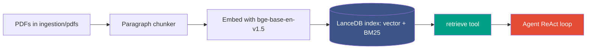

# Appendix B: Setting up the RAG agent infrastructure

A good reference librarian does not memorize every book; they know how to look
things up on demand. Retrieval-augmented generation gives an agent the same
habit: instead of leaning on what the model happened to absorb in training, the
agent looks up passages from a corpus you control and answers from those.
Think of this appendix as setting up the agent's library and teaching it to use
the card catalog.

Appendix A got the project running and built the corpus in passing. This
appendix goes a level deeper into the retrieval stack: how documents become a
searchable index, how the agent queries it, and which knobs to turn when the
answers are not good enough. The shipped corpus works out of the box, so you can
read this once now and come back when you want HelixAgent to answer from your
own documents.

## B.1 The moving parts

Retrieval in this repo is a short pipeline, and every stage is a plain Python
module you can read. PDFs are chunked into paragraphs, each chunk is embedded
into a vector, and the vectors plus their text land in a LanceDB index. At query
time a `retrieve` tool searches that index, and the agent's loop decides when to
call it.



Remember, the agent does not see the whole corpus. It sees only the handful of
chunks the `retrieve` tool returns for a given query, so the quality of the
chunking and the index matters as much as the prompt.

| Stage | Where it lives |
|-------|----------------|
| Fetch the default papers | `ingestion/download_corpus.py` |
| Build the index from PDFs | `ingestion/build_index.py` |
| Chunk text into paragraphs | `helix/retrieval/chunker.py` |
| Embed and store, hybrid search | `helix/retrieval/index.py` |
| The `retrieve` tool the agent calls | `chapters/ch02/agent_v0.py` |
| The agent loop that calls it | `helix/agent.py` |

## B.2 Build the corpus

The book ships a prebuilt index at `data/helix_corpus.lance/`, so for the
chapters you do not have to build anything. You only rebuild when you want
HelixAgent to retrieve from your own documents. The workflow is three steps:
drop PDFs in, build, run.

```
# optional: fetch the default paper set the book uses
python ingestion/download_corpus.py

# put your own PDFs in ingestion/pdfs/ as well, then build
python ingestion/build_index.py
```

`build_index.py` is idempotent: it deletes the existing index and rebuilds from
scratch, so re-running after you add PDFs is safe. It extracts text page by page
with pypdf, chunks each page, embeds every chunk, writes the rows, and builds
the BM25 full-text index at the end. The first build downloads the embedding
model (~440 MB) into your Hugging Face cache; later builds are offline.

As a general rule, start with the shipped corpus, confirm the agent works, and
only swap in your own PDFs once you have seen the round trip succeed.

## B.3 How chunking works

Chunking is where most retrieval quality is won or lost, so it is worth
understanding before you tune anything. The chunker in `helix/retrieval/chunker.py`
targets paragraph-sized pieces of 200 to 400 tokens, with a hard ceiling of 480
to stay under the embedding model's 512-token limit. It splits text on blank
lines, merges short paragraphs up toward the target, and splits any paragraph
that runs over the ceiling by sentence, then by words if a sentence is somehow
still too long.

Each chunk carries its `source` filename, `page` number, and a `paragraph_idx`,
so a retrieved passage can always be traced back to where it came from. Those
fields are what let the agent cite a source instead of asserting a fact from
nowhere.

The three knobs are `target_min`, `target_max`, and `hard_ceiling`, all
arguments to `chunk_text`. Smaller chunks give more precise matches but more
fragments to stitch together; larger chunks give more context per hit but blur
what the match was actually about. To change them, edit the `chunk_text` call in
`build_index.py` and rebuild.

## B.4 How embedding and the index work

Each chunk is embedded with `BAAI/bge-base-en-v1.5`, a 768-dimension model that
runs on CPU, with vectors normalized so cosine similarity is a dot product. The
vectors and text go into a LanceDB table named `corpus`, alongside the source,
page, and paragraph index. LanceDB also builds a BM25 full-text index over the
text column, which is what makes keyword search possible.

The payoff is **hybrid search**: the default `retrieve` combines vector
similarity with BM25 keyword matching, so it catches both semantic paraphrases
and exact terms like model names or acronyms. The index exposes three modes, and
you pick per call.

- **hybrid** (default): vector plus BM25. The best general choice, and what the agent uses.
- **vector**: pure semantic similarity. Good for paraphrased or conceptual queries.
- **keyword**: pure BM25. Good when the query is a precise term and you want exact matches.

Remember, the embedding model fixes the vector dimension. If you swap the model
in `helix/retrieval/index.py`, update `EMBED_DIM` to match and rebuild the index
from scratch, or the new vectors will not fit the old schema.

## B.5 The retrieve tool

The tool the agent actually calls lives in `chapters/ch02/agent_v0.py` as
`build_retrieve_tool()`. It opens the index once, then exposes a small async
function that searches in hybrid mode and returns the top matches as plain
dictionaries.

```python
@tool(description=RETRIEVE_DESCRIPTION_V0)
async def retrieve(query: str, k: int = 5) -> list[dict]:
    hits = index.search(query, k=k, mode="hybrid")
    return [
        {"source": h.source, "page": h.page, "text": h.text, "score": h.score}
        for h in hits
    ]
```

The `@tool` decorator does the wiring you would otherwise write by hand: it reads
the function's type hints, builds a Pydantic argument schema, and renders the
OpenAI-style function spec the model needs to call it. The `description` is what
the model reads to decide when and how to call the tool, which is exactly the
string Chapter 3 puts under search. For now it is a fixed sentence, and `k`
controls how many passages come back per call.

## B.6 Wiring retrieval into an agent

A RAG agent in this repo is just an `Agent` constructed with a system prompt and
the retrieve tool. The agent runs a ReAct loop: it sends the question and the
tool spec to the model, the model decides to call `retrieve`, the agent runs the
call and feeds the passages back, and the loop continues until the model
answers. You get the answer and a full trajectory back.

```python
import asyncio
from helix.agent import Agent
from chapters.ch02.agent_v0 import build_system_prompt, build_retrieve_tool, DEFAULT_MODEL

async def main():
    agent = Agent(
        system_prompt=build_system_prompt(),
        tools=[build_retrieve_tool()],
        model=DEFAULT_MODEL,
    )
    answer, trajectory = await agent.run("What does GEPA stand for?")
    print(answer)
    print("retrieve calls:", sum(1 for s in trajectory.steps if s.kind.value == "tool_call"))

asyncio.run(main())
```

The runnable version of this is `chapters/ch02/01_helixagent_v0.py`; run that
rather than retyping the snippet. The `Agent` bounds the loop with
`max_iterations` (default 10) and `max_tool_calls` (default 20) so a confused
agent cannot retrieve forever. As a general rule, start with one retrieve tool
and the default limits, and only add tools once the single-tool agent works.

## B.7 Verify retrieval quality

Before blaming the agent, check the index directly. Retrieval problems almost
always live in the corpus or the chunks, not the prompt, and you can see the raw
hits without any model in the way. Run this from the repository root.

```python
from helix.retrieval.index import open_index

index = open_index("data/helix_corpus.lance")
for hit in index.search("What does GEPA stand for?", k=5, mode="hybrid"):
    print(f"{hit.score:.3f}  {hit.source} p{hit.page}: {hit.text[:80]}")
```

If the right passage shows up near the top, retrieval is healthy and any bad
answer is a prompt problem. If it does not, the fix is upstream: a missing
document, a scanned PDF with no text layer, or chunks that split the answer
across two pieces. Try the same query in `vector` and `keyword` mode to see
which half of the hybrid is pulling its weight.

## B.8 Tuning knobs

The handful of dials worth knowing, and what each one trades off.

| Knob | Where | Effect |
|------|-------|--------|
| `k` | `retrieve(query, k=...)` | More passages per call: more context, more tokens, more noise. |
| `mode` | `index.search(..., mode=...)` | hybrid / vector / keyword. Switch when one retrieval style misses. |
| `target_min` / `target_max` | `chunk_text` in `build_index.py` | Chunk size. Smaller is more precise, larger carries more context. |
| Embedding model | `EMBED_MODEL_NAME` / `EMBED_DIM` in `index.py` | Retrieval quality and speed. Changing it requires a full rebuild. |

Remember, any change to chunking or the embedding model means rebuilding the
index. The `retrieve` knobs (`k` and `mode`) are live and need no rebuild.

## B.9 Troubleshooting

The issues readers actually hit with retrieval, and the fix for each.

| Symptom | Cause and fix |
|---------|---------------|
| `FileNotFoundError: No corpus found` | The index is missing. Run `python ingestion/build_index.py` or pull the shipped index. |
| `retrieve` returns nothing useful | The answer may not be in the corpus, or chunks split it. Query the index directly (B.7) to confirm. |
| A PDF contributes zero chunks | It is likely scanned with no text layer. Run it through OCR first, then rebuild. |
| Keyword search returns nothing | The BM25 index was not built. Re-run `build_index.py`, which calls `build_fts()` at the end. |
| Schema or dimension error after changing models | `EMBED_DIM` no longer matches the model. Fix it and rebuild from scratch. |
| First query is slow | The embedding model is loading on first use. It stays cached for the rest of the process. |

## Where to go next

You now have a corpus, an index, and an agent that answers from it. Run
`chapters/ch02/01_helixagent_v0.py` to see the whole stack work, then head into
Chapter 2 to start improving the agent's prompt. Retrieval itself becomes a
target for improvement later: Chapter 3 puts the tool description, and
eventually the chunking and embedding choices, under search, so the agent can
get better at looking things up rather than just better at phrasing answers.
